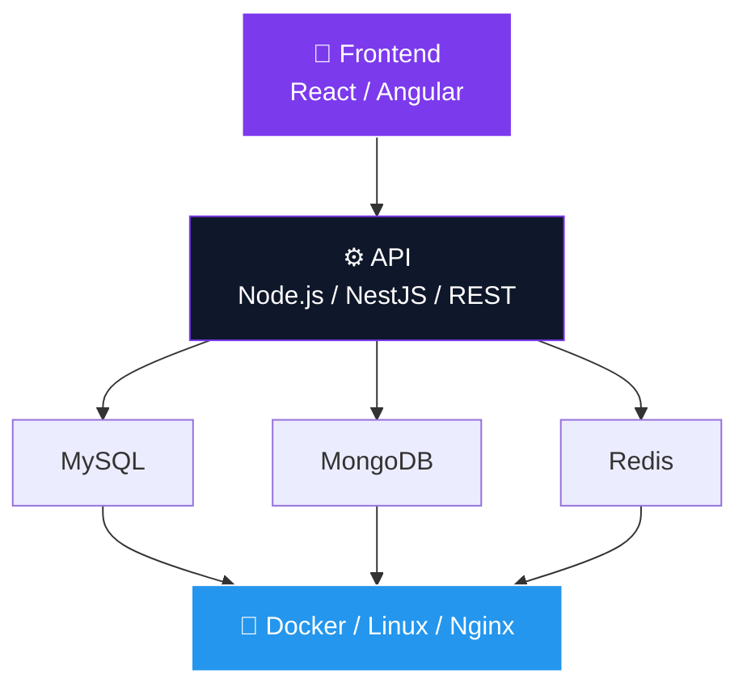

  

  
  
  
  

  
  
  

---

### 🚀 Sobre mim

<table>
<tr>
<td width="60%">

💻 **Full Stack Developer** focado no ecossistema **JavaScript/TypeScript**

Construo aplicações completas — da interface à infraestrutura — com ênfase em **APIs REST**, integração entre sistemas, arquitetura e performance.

- 🔙 Backend com **Node.js, TypeScript e NestJS**
- 🎨 Frontend com **React e Angular**
- 🗄️ Relational & NoSQL: **MySQL, MongoDB, Redis** + **Drizzle ORM**
- 🔌 Integração de APIs, autenticação/autorização
- 🧪 **Jest, Cucumber, BDD** — testes unitários e integração
- 🐳 **Docker & Docker Compose**, **Nginx**, **Git/GitLab**
- 🐧 **Linux** e infraestrutura de servidores
- ☕ **Java** | 🦀 **Rust** | 🤖 Interesse em **IA / LLMs**
- 🔧 Curioso por **hardware & eletrônica**

</td>
<td width="40%" align="center">
  
   
  
</td>
</tr>
</table>

---

### 🛠️ Tech Stack

  

<b>💻 Linguagens</b>

 

  
  
  
  

<b>🎨 Frontend</b>

 

  
  
  
  
  

<b>⚙️ Backend</b>

 

  
  
  
  

<b>🗄️ Bancos de Dados</b>

 

  
  
  
  

<b>🧪 Testes</b>

 

  
  
  

<b>🐳 DevOps & Infra</b>

 

  
  
  
  
  

---

### 🧠 Arquitetura & Desenvolvimento

> Sistemas completos, do pixel ao container.

  
  

---

### 📊 GitHub Stats

  
  

  
  

  

---

### 🐍 Contribution Snake

  <picture>
    <source media="(prefers-color-scheme: dark)" srcset="https://raw.githubusercontent.com/Lucas-Dsra/Lucas-Dsra/output/github-snake-dark.svg" />
    <source media="(prefers-color-scheme: light)" srcset="https://raw.githubusercontent.com/Lucas-Dsra/Lucas-Dsra/output/github-snake.svg" />
    
  </picture>
  ⚡ Ative o workflow <code>snake.yml</code> abaixo para animar automaticamente

---

### 📫 Contato

  
  
  <!-- Troque pelo seu LinkedIn real -->
  

  

<!-- 
  ⭐ DICA: Para ativar a Snake Animation
  1. Crie o repositório Lucas-Dsra/Lucas-Dsra (se ainda não existir)
  2. Adicione .github/workflows/snake.yml (arquivo já incluso abaixo)
  3. Em Settings > Actions > General > Workflow permissions > marque "Read and write permissions"
  4. Rode o workflow manualmente uma vez em Actions > Snake > Run workflow
-->
